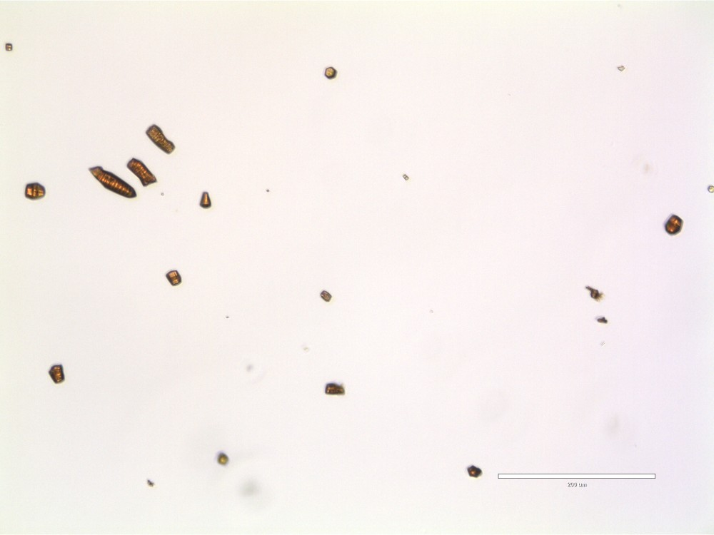
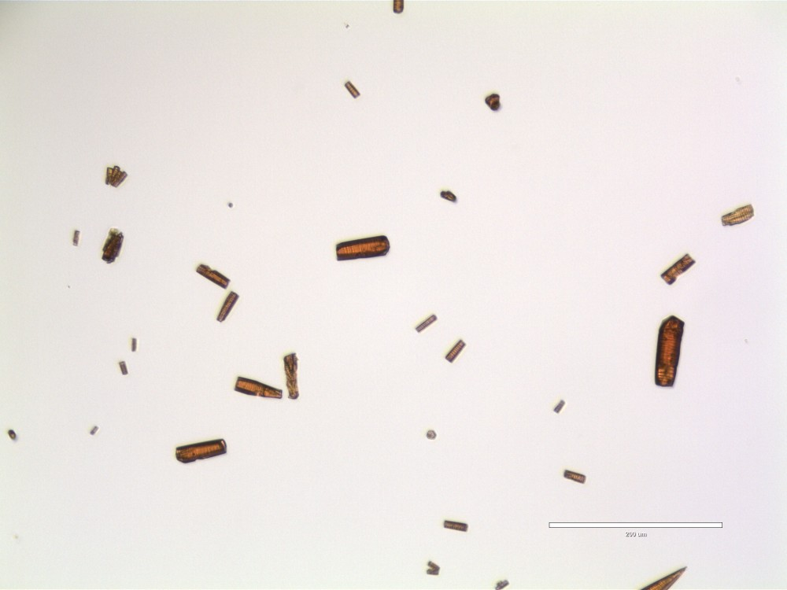
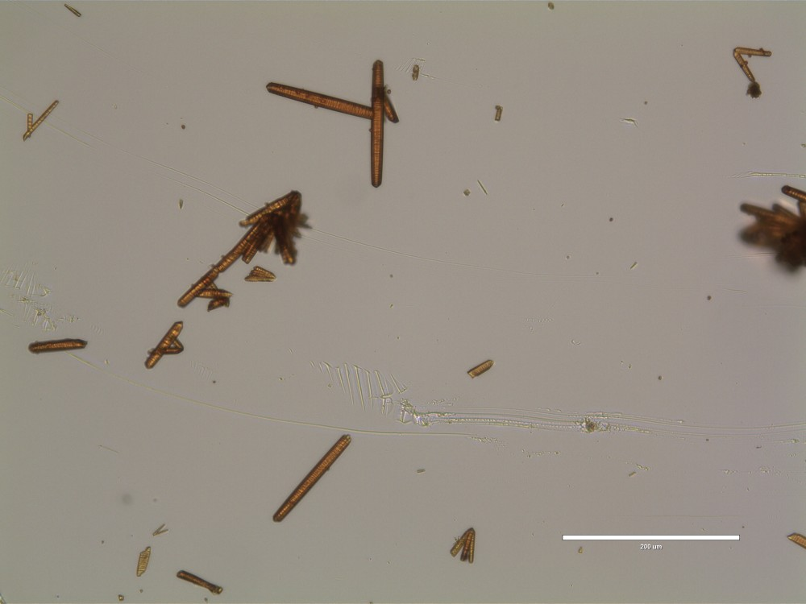
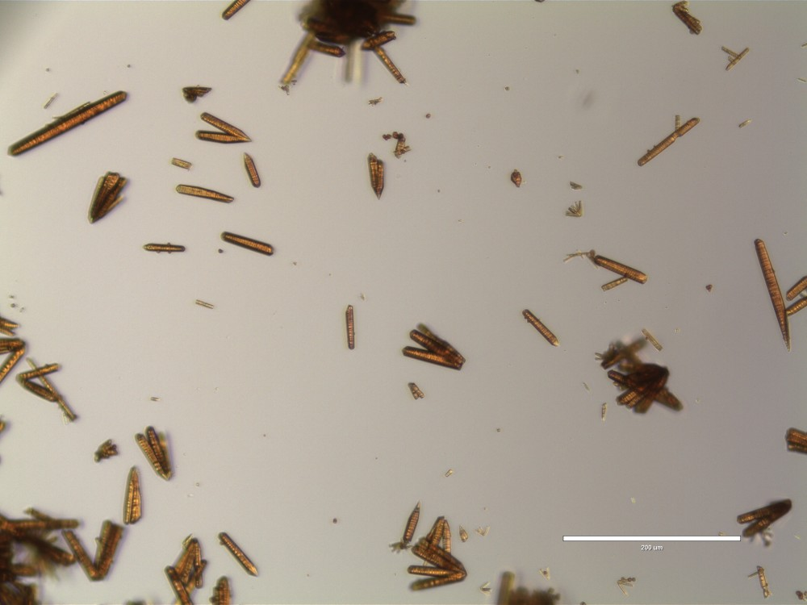
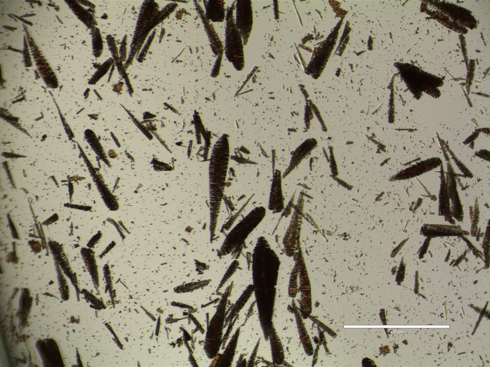
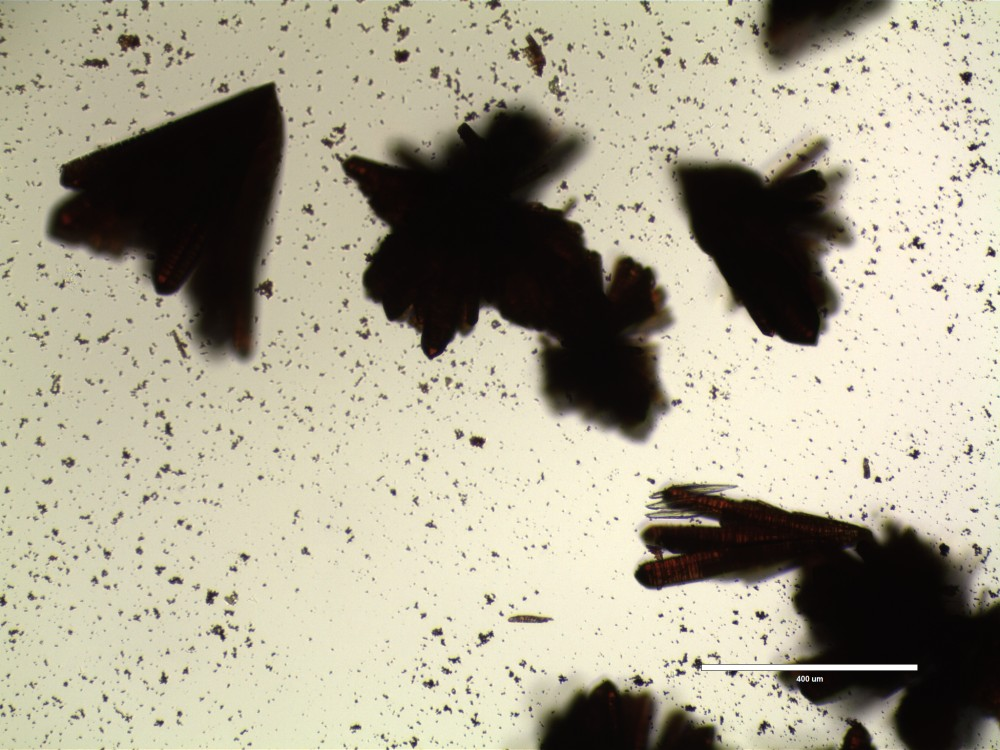
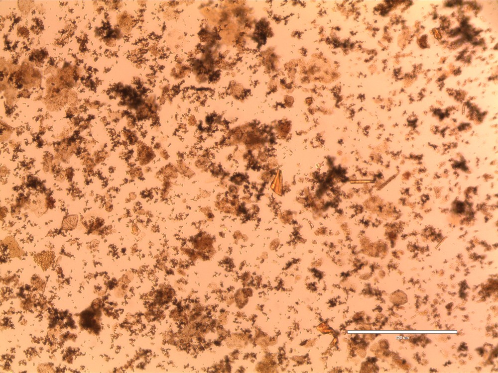

# Co-MOF

## Environment
They can be installed using conda or a `requirements.txt` file.
### Using the conda environment file
1) Install conda
2) Create a new environment using `conda env create -f environment/conda/environment.linux.yml`

### Using the requirements.txt file
1) Use `pip install -r environment/requirements.txt` to install dependencies. If creating your own environment, `python >= 3.10` is recommended.

## Dataset
The dataset is located in `co-mof_dataset/`, and contains images as well as supporting files

In `images/`, there are a total of 796 images organized by batches. Each batch follows a specific procedure defined in `batches.json`. The procedures in `batches.json` are defined in the `procedures.json` file. `mof_dataset.csv` contains the relative image paths relative to the `Co-MOF/` directory, as well as the procedure, batch, and synthesis condition for each image. Synthesis conditions are defined in `synthesis_conditions.json`.

When cloning this repository from GitHub, most images will be missing from `images/`. The remaining images can be downloaded `TODO: HERE`. After downloading all the images, run the code in the `unit_testing.ipynb` notebook. This notebook will load `mof_dataset.csv` into a pandas DataFrame, and attempt to open and close each image in the dataset to verify the image files' integrity as well as the CSV file.

## Example Usage
The `example_usage.ipynb` demonstrates how to use Bok Choy with an optical microscopy image of MOFs. Using Bok Choy, results can be saved to a CSV file or plotted.

## Expected Results
Image/sample quality has a significant impact on areas and aspect ratios determined by the Bok Choy algorithm. 

Here are some examples of images with good, reasonable, and bad expected results:

### Good Results Expected
<p align="center">
    </img>
    </img>
</p>

### Reasonable Results Expected

<p align="center">
    </img>
    </img>
</p>

### Bad Results Expected
<p align="center">
    </img>
    </img>
    </img>
</p>

## Citation
If you use this dataset or Bok Choy in your research, please cite the following:

### BibTeX

```bibtex
@article{Chong2025,
  title = {Controlling metal–organic framework crystallization via computer vision and robotic handling},
  ISSN = {2050-7496},
  url = {http://dx.doi.org/10.1039/D5TA03199K},
  DOI = {10.1039/d5ta03199k},
  journal = {Journal of Materials Chemistry A},
  publisher = {Royal Society of Chemistry (RSC)},
  author = {Chong,  Kai Xiang and Alsabia,  Qusai Abdulkhaliq and Ye,  Zuyang and McDaniel,  Andrew and Baumgardner,  Douglas and Xiao,  Dianne and Sun,  Shijing},
  year = {2025}
}
```


