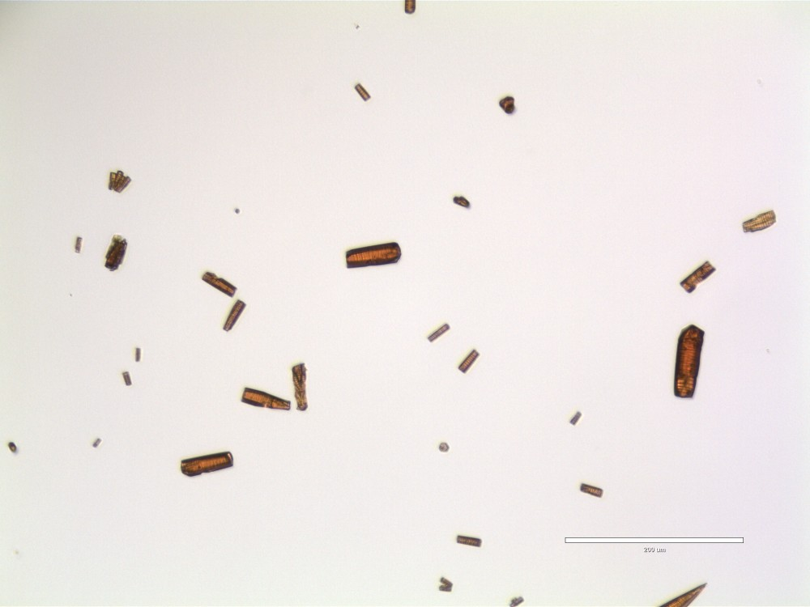

# Co-MOF

## Environment
The can be install using conda.
1) Install conda
2) Create a new environment using `conda env create -f environment/conda/environment.linux.yml` Alternativelty you can use `pip install -r environment/requirements.txt` to install dependencies. If creating your own enviroment, `python >= 3.10` is recommended.

## Dataset
The dataset is located in `co-mof_dataset/`, and contains images as well as supporting files

In `images/`, there are a total of 796 image organized by batches. Each batch follows a specific procedure defined in `batches.json`. The procedures in `batches.json` are defined in the `procedures.json` file. `mof_dataset.csv` contains the relative image paths relative to the `Co-MOF/` directory, as well as the procedure, batch, ans synthesis condition for each image. Synthesis conditions are defined in `synthesis_conditions.json`.

When cloning this repository from GitHub, most images will be missing from `images/`. The remaining images can be downloaded `TODO: HERE`. After downloading all images, run the code in the `unit_testing.ipynb` notebook. This notebook will load `mof_dataset.csv` into a pandas DataFrame, and attempt to open and close each image in the dataset to verify the image files' integrity as well as the CSV file.

## Example Usage
The `example_usage.ipynb` demonstrates how to use Bok Choy with an optical microscopy image of MOFs. Using Bok Choy, results can be saved to a CSV file or plotted.

## Expected Results
Image/sample quality has a significant impact on areas and aspect ratios determined by the Bok Choy algorithm. 

Here are some example of images with good, reasonable, and bad expected results:

### Good Results Expected

    </img>
    </img>
    </img>

### Reasonable Results Expected

    </img>
    </img>

### Bad Results Expected

    </img>
    </img>
    </img>

